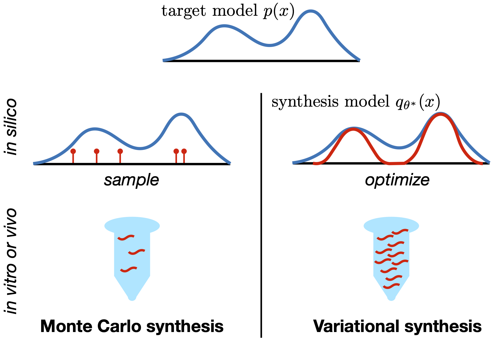

# Variational Synthesis
This repo provides example code implementing variational synthesis, as introduced in the paper

> Optimal Design of Stochastic DNA Synthesis Protocols based on Generative Sequence Models.
> Eli N. Weinstein, Alan N. Amin,  Will Grathwohl, Daniel Kassler, Jean Disset, Debora S. Marks.
> 2021.

## Installation
Download this repo, create a new virtual environment (e.g. using conda) with python 3.9, and run

    pip install .

To test your installation, navigate to the `VariationalSynthesis` subfolder and run

    pytest

## Optimizing stochastic synthesis protocols

To optimize an example stochastic synthesis model, navigate to the `VariationalSynthesis` subfolder and run

    python model.py data/config_ex.cfg

A detailed description of the method's options can be found in the config file `data/config_ex.cfg`.

**Data:** Stochastic synthesis models are optimized on samples from target distributions: this can be controlled with the `[general][target_samples]` option in the config file. In particular, the datasets used in the paper are samples from a DHFR Potts model (which can be found in `data/DHFR_Potts.fasta`), raw evolutionary DHFR sequences (`data/DHFR_raw.fasta`), samples from a GFP ICA-MuE model (`data/GFP.fasta`) and a TCR ICA-MuE model (`data/TCR.fasta`).

**Models:** Our synthesis models use either fixed or combinatorial assembly: this can be controlled with the `[model][assembly]` option in the config file. Our synthesis models also use either enzymatic mutagenesis, finite nucleotide mixtures, finite codon mixtures or arbitrary codon mixtures: this can be controlled with the `[model][unit]` and `[model][constraint]` options in the config file.

**Results:** Results will (by default) be put in a time-stamped subfolder within the `data/logs` folder. The example input (`data/config_ex.cfg`) trains a finite codon mixture model with fixed assembly and M=10 on the raw DHFR dataset. In the output config file (the `[results][perpl_per_res]` section), we report the perplexity of the trained synthesis model: 9.2, which matches Figure 3D of the paper. The trained parameters of the model are pickled in the output `params.pkl` file; they can be loaded from within python with

    import pickle
    from VariationalSynthesis.model import SynthesisModel
    with open('data/logs/TIMESTAMP/params.pkl', 'rb') as pr:
        model = pickle.load(pr)

with `TIMESTAMP` replaced by the time-stamp of your results.
